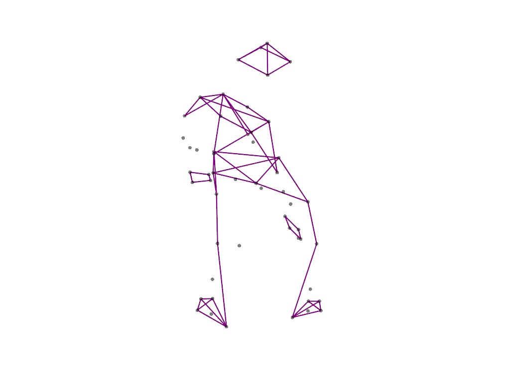
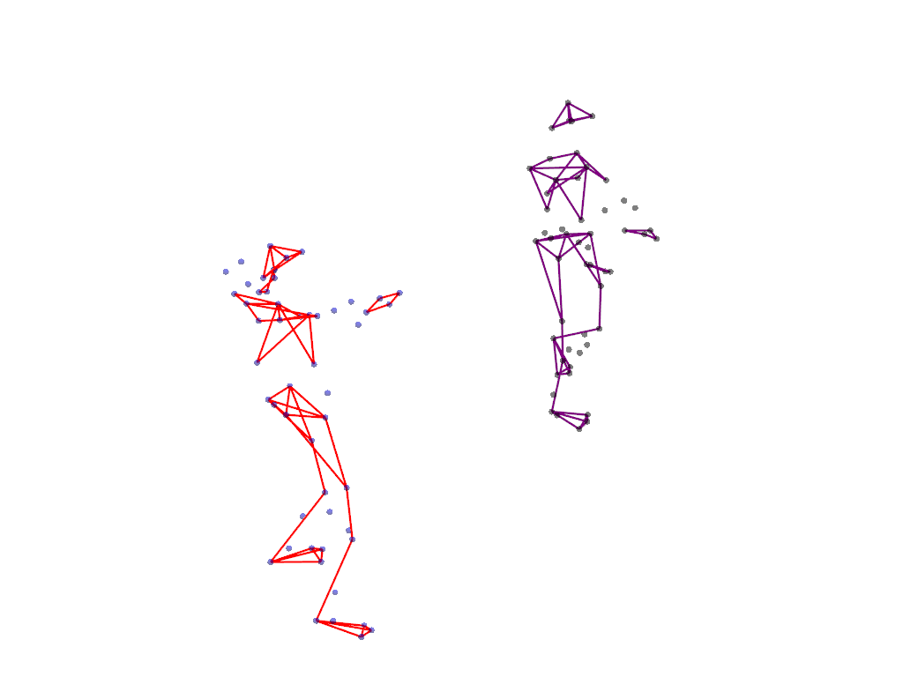
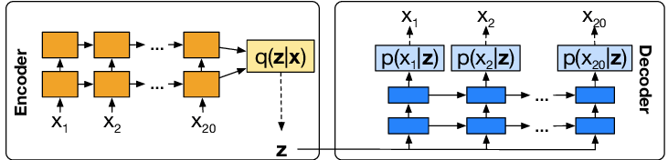

<h1 align="center">
  AI-Enabled Choreography
  <br>
</h1>

<h4 align="center">
A VAE-LSTM model for generating dance choreography, built for the GSoC
<a href="https://docs.google.com/document/d/18yE220TOWpXUddu8lRX2KDuuJUgDyL9PItDjxOjJkCI/edit" target="_blank">test</a>.</h4>

| Example 1                            | Example 2                            |
| ----------------------------------- | ----------------------------------- |
|  |  |

## Key Features

What we can do:

* visualize the stick figure
* compare the original and ghosted stick figure
* construct a slider widget to control the frame
* transform the animation into a gif
* generate a new dance sequence of any length

## How to Use

```bash
# Clone this repository
$ git clone https://github.com/ChenZiHong-Gavin/AI-Enabled-Choreography

# install the requirements
pip install -r requirements.txt
```

## Structure
    
```bash
AI-Enabled-Choreography
│
├── data   # data folder
│   ├── animations   # animations generated
│   ├── mariel_*.npy  # dance sequences
├── functions
│   ├── load_data.py # dataloader
│   ├── model.py #  VAE-LSTM model
│   ├── plotting.py # functions for plotting
│   ├── main.py # main function
├── images
├── logs # tensorboard logs
├── models # saved models
├── notebooks # jupyter notebooks and output pdf

```

## Architecture of the Model


The VAE component is responsible for learning a latent representation of the input dance sequences. It consists of an encoder network that maps the input dance sequence to a lower-dimensional latent space, and a decoder network that reconstructs the original dance sequence from the latent space. The encoder network captures the essential features and patterns of the input sequences, while the decoder network generates new dance sequences based on the learned latent representation.

The LSTM component is a type of recurrent neural network (RNN) that can model the temporal dependencies in the dance sequences. It processes the latent representation generated by the VAE encoder and learns to generate dance steps one at a time, conditioned on the previous steps. By incorporating LSTM, the model can capture the sequential nature of dance movements and generate coherent and realistic dance sequences.

## References

[1] Srivastava, Nitish, Elman Mansimov, and Ruslan Salakhudinov. "Unsupervised learning of video representations using lstms." International conference on machine learning. PMLR, 2015.

[2] Hsu, Wei-Ning, Yu Zhang, and James Glass. "Unsupervised domain adaptation for robust speech recognition via variational autoencoder-based data augmentation." 2017 IEEE Automatic Speech Recognition and Understanding Workshop (ASRU). IEEE, 2017.

[3] https://github.com/CUN-bjy/lstm-vae-torch

[4] https://github.com/mariel-pettee/choreo-graph

[5] https://github.com/mariel-pettee/choreography

## License

MIT

---

